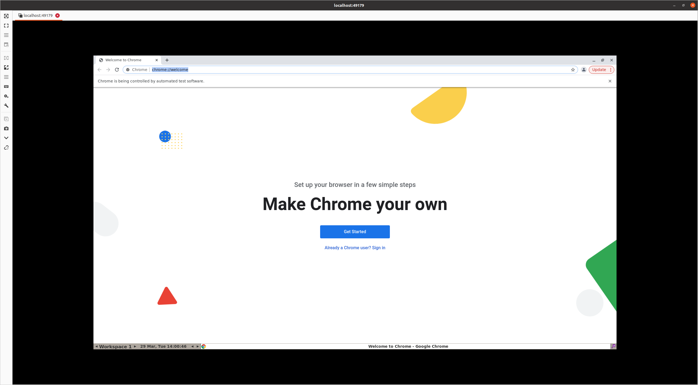

import ClipboardButton from '@site/src/components/ClipboardButton';

# Local Docker

We maintain Docker Images for running askui tests locally and in CI piplines. The images contain the askui-Server and a specified browser with a specified browser version. The askui library can connect to the docker container and execute the defined test steps inside it.

## Authentication

Currently the images are not public so you need to authenticate to access them. The username and token will be provided by your contact person at askui. The token is the one you also use for downloading the library.

```shell
docker login registry.gitlab.com -u <username> -p <token>
```

## Available Images

The images can be downloaded from

`registry.gitlab.com/vqa4gui/mvp/control-your-ui/browser/<browser>:v0.8.0-<browser_version>-<plattform>`

The following list shows the prebuild images we currently provide:

| browser | browser version | release version | platform| |
|---|---|---|---|---|
| chrome | 100.0.4896.60 | v0.8.0  | amd64 | <ClipboardButton link="registry.gitlab.com/vqa4gui/mvp/control-your-ui/browser/chrome:v0.8.0-100.0.4896.60-amd64"></ClipboardButton> |
| chrome | 99.0.4844.51 | v0.8.0  | amd64 | <ClipboardButton link="registry.gitlab.com/vqa4gui/mvp/control-your-ui/browser/chrome:v0.8.0-99.0.4844.51-amd64"></ClipboardButton> |
| chrome | 97.0.4692.71 |  v0.8.0 | amd64 | <ClipboardButton link="registry.gitlab.com/vqa4gui/mvp/control-your-ui/browser/chrome:v0.8.0-97.0.4692.71-amd64"></ClipboardButton> |
| chrome | 90.0.4430.212 |  v0.8.0 | amd64 | <ClipboardButton link="registry.gitlab.com/vqa4gui/mvp/control-your-ui/browser/chrome:v0.8.0-90.0.4430.212-amd64"></ClipboardButton> |
| firefox | 98.0.2 | v0.8.0  | amd64 | <ClipboardButton link="registry.gitlab.com/vqa4gui/mvp/control-your-ui/browser/firefox:v0.8.0-98.0.2-amd64"></ClipboardButton> |
| firefox | 97.0.2 | v0.8.0  | amd64 | <ClipboardButton link="registry.gitlab.com/vqa4gui/mvp/control-your-ui/browser/firefox:v0.8.0-97.0.2-amd64"></ClipboardButton> |
| firefox | 96.0.3 | v0.8.0  | amd64 | <ClipboardButton link="registry.gitlab.com/vqa4gui/mvp/control-your-ui/browser/firefox:v0.8.0-96.0.3-amd64"></ClipboardButton> |
| firefox | 82.0.3 | v0.8.0  | amd64 | <ClipboardButton link="registry.gitlab.com/vqa4gui/mvp/control-your-ui/browser/firefox:v0.8.0-82.0.3-amd64"></ClipboardButton> |


:::caution

We do not currently offer images for **ARM**.

:::

You can either use testcontainers to download an image as shown in the next chapter or download a container manually with the following command:

```shell
docker pull registry.gitlab.com/vqa4gui/mvp/control-your-ui/browser/<browser>:<releaseVersion>-<browserVersion>-amd64
```

## Configure a Container

When starting a container the following environment variables can be used to configure it:

| Env | type | default value | description |
|---|---|---|---|
| ENABLE_VNC | boolean | false | Start VNC so that you can connect and observe whats happening in the container. |
| SCREEN_RESOLUTION | string | 1920x1080 | Define the screen resolution of the testcontainer in the format *width* x *height* |


## Start Container in Jasmin Test Suite

The following example shows how to use the containers locally in a jasmine test suite.

First install [testcontainers](https://github.com/testcontainers/testcontainers-node), a NodeJS library that supports tests, providing lightweight, throwaway instances of common databases, Selenium web browsers, or anything else that can run in a Docker container.

```shell
npm i testcontainers
```

Then to run your tests inside one of the prebuild containers, use the following example of the `beforeAll` function:

```js
import * as askui from '@vqa4gui/askui';
import { StartedTestContainer, GenericContainer } from 'testcontainers';

jasmine.DEFAULT_TIMEOUT_INTERVAL = 60 * 1000 * 60;

describe('jasmine demo with askui', () => {
  let newClient: askui.Client;

  beforeAll(async () => {
    const browser = 'chrome';
    const releaseVersion = 'v0.8.0';
    const browserVersion = '99.0.4844.51';
    const containerPath = `registry.gitlab.com/vqa4gui/mvp/control-your-ui/browser/${browser}:${releaseVersion}-${browserVersion}-amd64`;

    const container: StartedTestContainer = await new GenericContainer(containerPath)
      .withEnv('ENABLE_VNC', 'true')
      .withEnv('SCREEN_RESOLUTION', '1920x1080')
      .withExposedPorts(6769, 5900)
      .start();

    console.log(`VNC link: ${container.getHost()}:${container.getMappedPort(5900)}`);
    newClient = new askui.Client({
      controlServerUrl: `http://${container.getHost()}:${container.getMappedPort(6769)}`,
    });
    await newClient.start();
  });
});
```

:::caution

Testcontainers maps the specified ports to some random available ports to prevent collision of ports. Therefore to connect via VNC you need to connect to the port logged to the console and not to port 5900.

:::

## Connect via VNC

To check what is happening inside a running testcontainer you can connect via VNC. For this you need a VNC client like [Remmina](https://remmina.org/). When running the example code from the previous chapter, the containers VNC port will be logged to the console. Use this port to connect. When connecting enter the password `askui` when asked.


Example of a VNC connection with a chrome browser running inside a container.
