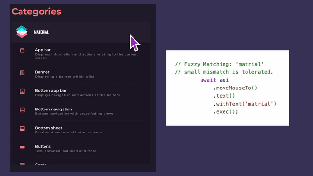
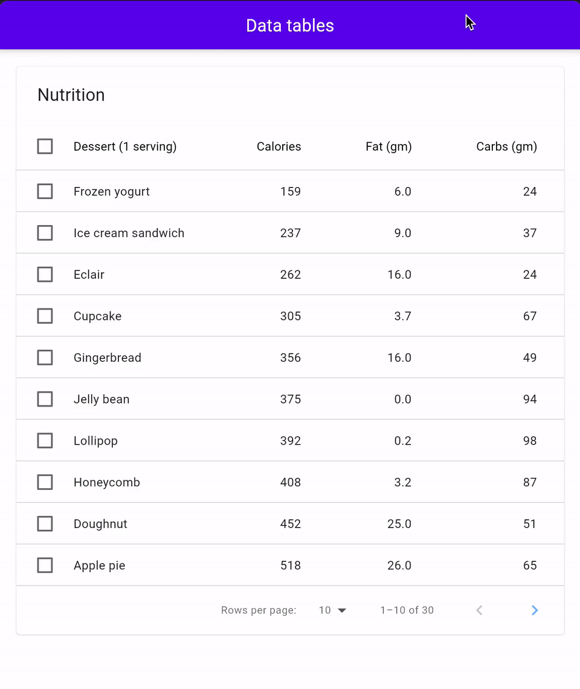

# Text Selectors

A human usually needs only the written text or visual properties of elements to understand a graphical user interface. The askui library provides multiple methods to interact with text of the UI.

When using askui for automated tests, text elements are playing a big role, since they typically appear more distinctively than other elements such as icons or text fields. Hence, knowing the benefits of using different text filters can become critical in scaffolding a robust test suite.

askui provides four different methods to handle text elements:

- `containsText()`
- `withExactText()`
- `withText()`
- `withTextRegex()`

For a convenient demonstration, we will use a [Flutter web demo](https://gallery.flutter.dev/#/demo) provided by Flutter. 

------

## Basic Text Matching

The simplest way to interact with a text element is to use `withText()`. Go to the demo app page and run the code below:

```ts
await aui.moveMouseTo().text().withText('matrial').exec();
await aui.mouseLeftClick().exec();
```



`withText()` tries to find a text that matches the whole sequence. In most test cases, you will want to stick to this method, as it supports **Fuzzy Matching** and tolerates misspelled text. **Note that the above example code has two typos**. `matrial` doesn't match the text in the demo app, which is `Material`, although askui will find the text element that roughly matches the text on the screen.

------

## Match a Sub-string within a Text

Even though the method `withText()` is handy and quite reliable, you might face a test case where you know only a fraction of the text element that you want to interact with. In such a case, `containsText()` is the method you might want to use:

```ts
await aui.moveMouseTo().text().containsText('Bottom').exec();
await aui.mouseLeftClick().exec();
```


Be aware that even if the method `containsText()` also supports **Fuzzy Matching**, it won't match the whole sequence by just a few characters. Try to use this code with the given demo app:

```ts
// this will fail
await aui.moveMouseTo().text().containsText('Bottm').exec(); 
```

You will notice that askui fails to match the given text `Bottm`, whereas this code will work:

```ts
// this will success
await aui.moveMouseTo().text().containsText('Bottm appbar').exec(); 
// this will also success
await aui.moveMouseTo().text().containsText('Bottom').exec(); 
```

The biggest difference between `withText()` and `containsText()` is whether it matches the text as a whole sequence or not. Matching many texts with a repeating affix could be a practical use case for the `containsText()`.

It is recommended to experiment enough with these methods to find a better option that suits your specific case, since it's not easy to predict if the given text can be fuzzy-matched with target texts.

------

## Match the Exact Text

If you already know what text you are looking for, or if there are too many similar text elements, we could use the method `withExactText()`.

From the main page of the demo app, go to `Material`->`Data tables`. You will see a table with different foods given with nutrition factors for each of them.

Let's say that we want to click on the items that has exactly **25.0 gm of Fat**. In our demo app, only the **Doughnut** is the matching item. Run this code and see how `withText()` matches the text:

```ts

// Use this helper function to calculate the centroid of the detected elements.
function getCentroid(element: any): any {
    let x = (element.bndbox.xmax - element.bndbox.xmin) / 2.0 + element.bndbox.xmin;
    let y = (element.bndbox.ymax - element.bndbox.ymin) / 2.0 + element.bndbox.ymin;
    return { x: x, y: y };
}

// Find all the text elements that matches '25.0'
const elts = await aui.get().text().withText('25.0').exec();

// Then, iterate through the found elements and click on them
for(let i=0; i<elts.length; ++i){
    const centroid = getCentroid(elts[i]);
    await aui.moveMouse(Math.round(centroid.x), Math.round(centroid.y)).exec();
    await aui.mouseLeftClick().exec();
}

```



You will see that askui clicks not only the **25.0** but also the **26.0**, which is the fat of the **Apple pie**. The result of this test code may differ in your case, because of the different screen resolution and the rendered-size of the demo app.

It will give you a clear idea where you will need to use the method `withExactText()` instead of `withText()`. Try to run the same code after replacing the `withText()` to `withExactText()`:

```ts
// Find all the text elements that matches '25.0' exactly
const elts = await aui.get().text().withExactText('25.0').exec();

// Then, iterate through the found elements and click on them
for(let i=0; i<elts.length; ++i){
    const centroid = getCentroid(elts[i]);
    await aui.moveMouse(Math.round(centroid.x), Math.round(centroid.y)).exec();
    await aui.mouseLeftClick().exec();
}
```


## Match Text with Regular Expression

The method `withTextRegex()` supports **Regular Expression** to match any text in the most flexible way. Although it might be tricky to use regex due to its esoteric appearance, it is maybe one of the best solution when it comes to character matching.

On the same page of the demo app, let's say that we want to click on the items whose Calorie is between 300 and 500 `(cal>=300 && cal<500)`. Since regex doesn't support numeric comparison, we will try to match the digits in a sequence:

```ts
// Find all the text that matches the expression
const cals = await aui.get().text().withTextRegex('[3-4][0-9]{2}').exec();

// Then, iterate through the found elements and click on them
for(let i=0; i<cals.length; ++i){
    const coord = getCentroid(cals[i]);
    console.log(cals[i].text, coord);
    await aui.moveMouse(Math.round(coord.x), Math.round(coord.y)).exec();
    await aui.mouseLeftClick().exec();
}
```


The regular expression `[3-4][0-9]{2}` means,
- **[3-4]**: Match one character between 3 and 4.
- **[0-9]**: Match one character between 0 and 9.
- **{2}**: Repeat the previous expression ([0-9]) two times.

As the result, it will try to match every text that has a sequence starting with the digit 3 or 4, and then has any two digits in a row.
