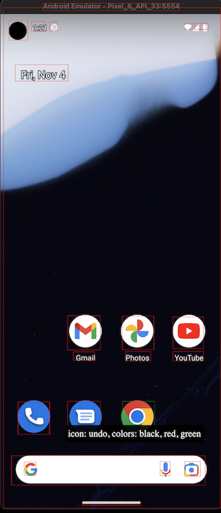
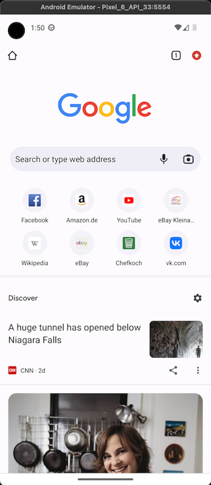
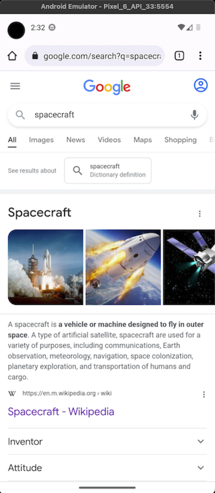

# Tutorial: Automate Web Search on Android Devices with askui

In this tutorial, we will automate web searching on Android devices. This tutorial assumes that you have already set up your Android Development Environment. If you haven't set it up yet, you can check out our [tutorial](https://docs.askui.com/docs/general/Tutorials/setup-android).

If you have already set up your test environment, go directly to [3. Automate Web Searching](#3-automate-web-searching)

**Index**

[1. Prepare the askui Test Environment](#1-prepare-the-askui-test-environment)  
[2. Try Annnotation](#2-try-annotating)  
[3. Automate Web Searching](#3-automate-web-searching)  
[4. Complete Test Code](#4-complete-test-code)  
[5. Conclusion](#5-conclusion)  


------

## Requirements
- **Android Studio** or **Android SDK Command-line Tools** installed.
- (optional) Android device, if you want to run your app on a real device.

------

## 1. Prepare the askui Test Environment

### Install and initialize askui

First, go to the directory where you have your npm project. If you don't have one, you can create it with `npm init`

Then, use the commands below to install askui alongside a few additional tools:
```bash
npm i -D askui typescript ts-node @types/jest ts-jest jest
npx askui init # this generates a test suite within the project directory
```

After creating the **askui test suite**, add your credentials in `helper/jest.setup.ts`:

```ts
 aui = await UiControlClient.build({
    credentials: {
      workspaceId: '<your workspace id>',
      token: '<your access token>',
    }
  });
  ```
💡 **askui credentials**: You can get your askui credentials from the [askui user portal](https://app.askui.com/) for free.


If you have any issues while setting up **askui**, you can have a look at the more descriptive [Getting Started](https://docs.askui.com/docs/general/Getting%20Started/getting-started) tutorial, or just drop by our [Discord](https://bit.ly/3ekHnGR) and ask the community.

**Configure askui for Android**

We need to run the UiController manually with an extra argument to specify the runtime mode, as the current version of askui(ver. 0.5) doesn't provide the API for running it with the runtime option yet.

```bash
cd <YOUR_PROJECT_DIRECTORY>/node_modules/askui/dist/release/latest/<YOUR_PLATFORM>
./askui-ui-controller -r android

# for example, Mac OS
cd node_modules/askui/dist/release/latest/darwin/askui-ui-controller.app/Contents/MacOS/
./askui-ui-controller -r android

# If you can't find the binary as described above,
# then you might have askui freshly installed and haven't run it yet.
# The binary gets downloaded as the askui test code runs.
# Run the command below to run the askui test code:
npx jest test/my-first-askui-test-suite.test.ts --config ./test/jest.config.ts
```

Thereafter, we have to change a few lines of the generated test code, as the code ships with the part that creates another **UiController** instance.

Go to `helper/jest.setup.ts` and comment out every line that is using `uiController`:

```ts
import { UiControlClient, UiController } from 'askui';

// Server for controlling the operating system
// let uiController: UiController;

// Client is necessary to use the askui API
// eslint-disable-next-line import/no-mutable-exports
let aui: UiControlClient;

jest.setTimeout(60 * 1000 * 60);

beforeAll(async () => {
//   uiController = new UiController({
//     /**
//      * Select the display you want to run your tests on, display 0 is your main display;
//      * ignore if you have only one display
//      */
//     display: 0,
//   });

//   await uiController.start();

  aui = await UiControlClient.build({
    credentials: {
      workspaceId: myworkspaceid,
      token: mytoken,
    }
  });

  await aui.connect();
});

afterAll(async () => {
//   await uiController.stop();

  aui.close();
});

export { aui };
```

------

## 2. Try Annotating
Make sure that your Android device is connected, or if you are using the Android Emulator, make sure that it is open and running on your computer.

**askui** provides a feature where you can monitor how the visible elements are understood by **askui**. Try to change the code within `test/my-first-askui-test-suite.test.ts`:
```ts
import { aui } from './helper/jest.setup';

describe('jest with askui', () => {
  it('should show the annotation', async () => {
    await aui.annotateInteractively();
  });
});
```

and run,
```bash
npx jest test/my-first-askui-test-suite.test.ts --config ./test/jest.config.ts
```




💡 **Annotation is Interactive**
*Try to hover your mouse on the red bounding box. It will let you know how to manipulate that element via askui*

## 3. Automate Web Searching
Now we are good to go for the actual automation process.
The automation consist of three steps:

1. Open Chrome
2. Select the search bar and type 'spacecraft'
3. Click on the desired search result

### 1) Open Chrome
To open Chrome, we first have to figure out how we can let **askui** know where to click on.

As we can see in the annotated image above, the Chrome icon is recognized as an `icon: undo`. Indeed, we could also tell **askui** to select the `icon: undo`, but we will try to do it in a more precise way.

What we're gonna do is:

**(1) Select the search bar**

**(2) Type 'chrome'**

**(3) Select the icon above the text 'chrome'**

This sideway approach will give us a more consistent result because typing chrome in the search bar will give us a more clearly understandable visual element.

Try to change your code according to this:

```ts
import { aui } from './helper/jest.setup';

describe('jest with askui', () => {
  it('should open chrome', async () => {

    // Here we try to avoid failing our test by using the try-catch phrase.
    // It is because, 'textfield' and 'textarea' are seeming quite the same, even if they are tagged with different names.
    try {
        await aui.click().textfield().exec();    
    } catch (error) {
        await aui.click().textarea().exec();
    }

    // Type the desired keyword into the search bar
    await aui.type('chrome').exec();

    // We wait for 1500 milliseconds, to make sure that the search result has been loaded before askui start to look for the search result. 
    await aui.waitFor(1500).exec(); 

    // Then click the icon that is above the text 'chrome'
    await aui.click().icon().above().text().withText('chrome').exec();
  });
});
```

and run,

```bash
npx jest test/my-first-askui-test-suite.test.ts --config ./test/jest.config.ts
```

Now you will be able to see that Chrome has been opened.

### 2) Select the Search Bar and Type 'spacecraft'
Let's select the search bar of chrome, and type our desired keyword in there.



Add this code block to the bottom of our code:

```ts
// We first look for the search bar. Depending on the system language of your device, the default text within the search bar may differ.
await aui.click().text().withText('search or type web address').exec();

// Type our desired keyword and hit enter
await aui.type('spacecraft').exec();
await aui.pressAndroidKey('enter').exec();
```

In some cases, when searching in Google, you will be asked to give consent for the cookies.
To avoid our test from failing, we have to examine whether we got a pop-up for the cookie consent or not:

```ts
try {
    // The `expect()` examines whether a specific element is detected or not.
    // A command starting with `expect()` must always end with `exists()` or `notExists()`
    await aui.expect().text().containsText('cookies').notExists().exec();
} catch (error) {
    await aui.click().text().withText('read more').exec();
    await aui.waitFor(1000).exec(); // wait until the scrolling animation has been finished
    await aui.click().text().withText('accept all').exec();
}
// From here, we can write our next test code
```

### 3) Click on the Desired Search Result



After clearing the cookie consent pop-up, we can see and click our desired search result. In our test case, we will look for the result from Wikipedia:

```ts
// We ask the askui to click the text that contains 'wikipedia',
//which is the text that is nearest to the text containing 'wikipedia.org'
await aui.click()
    .text()
    .containsText('wikipedia')
    .nearestTo()
    .text()
    .containsText('wikipedia.org')
    .exec();
```

Pay attention to the command `nearestTo()` that is interconnecting two different text elements.

**askui** offers several **Relational Commands**, which enable you to select the desired element by their screen position:

- [above()](https://docs.askui.com/docs/api/Relations/above)
- [below()](https://docs.askui.com/docs/api/Relations/below)
- [contains()](https://docs.askui.com/docs/api/Relations/contains)
- [in()](https://docs.askui.com/docs/api/Relations/in)
- [leftOf()](https://docs.askui.com/docs/api/Relations/leftof)
- [rightOf()](https://docs.askui.com/docs/api/Relations/rightof)
- [nearestTo()](https://docs.askui.com/docs/api/Relations/nearestto)

💡 **About withText() and containsText():**

You might wonder how `withText()` and `containsText()` differ. `withText()` tries to match the given text as the whole sequence, whereas `containsText()` tries to match the given text as a sub-text within the elements. Generally speaking, `containsText()` can be handier to match the text roughly, but you might face a test case where you want to find a specific text as a whole sequence.

------

## 4. Complete Test Code
```ts
import { aui } from './helper/jest.setup';

describe('jest with askui', () => {
  it('should search spacecraft in chrome', async () => {
    // Here we try to avoid failing our test by using the try-catch phrase.
    // It is because, 'textfield' and 'textarea' are seeming quite the same, even if they are tagged with different names.
    try {
        await aui.click().textfield().exec();    
    } catch (error) {
        await aui.click().textarea().exec();
    }
    // Type the desired keyword into the search bar
    await aui.type('chrome').exec();
    // We wait for 1500 miliseconds, to make sure that the search result has been loaded before askui start to look for the search result. 
    await aui.waitFor(1500).exec(); 
    // Then click the icon that is above the text 'chrome'
    await aui.click().icon().above().text().withText('chrome').exec();

    // We wait the Chrome app to be launched
    await aui.waitFor(1500).exec();

    // We first look for the search bar. Depending on the system language of your device, the default text within the search bar may differ.
    await aui.click().text().withText('search or type web address').exec();

    // Type our desired keyword and hit enter
    await aui.type('spacecraft').exec();
    await aui.pressAndroidKey('enter');

    // We wait for the search result to be loaded
    await aui.waitFor(3000).exec();

    try {
        // The `expect()` examines whether a specific element is detected or not.
        // A command starting with `expect()` must always end with `exists()` or `notExists()`
        await aui.expect().text().containsText('cookies').notExists().exec();
    } catch (error) {
        await aui.click().text().withText('read more').exec();
        await aui.waitFor(1000).exec(); // wait until the scrolling animation has been finished
        await aui.click().text().withText('accept all').exec();
    }

    // We ask the askui to click the text that contains 'wikipedia' which is the text that is nearest to the text containing 'wikipedia.org'
    await aui.click().text().containsText('wikipedia').nearestTo().text().containsText('wikipedia.org').exec();
  });
});
```

------

## 5. Conclusion

