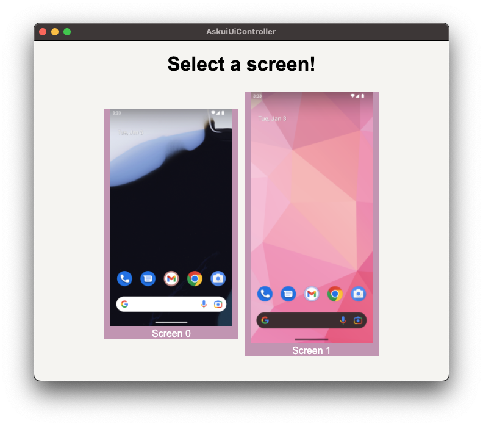

# Automate Multiple Devices

This tutorial shows how to automate multiple devices on the same network by using askui library. 


📌 *The following tutorial assumes that you have already installed and set up the askui library on your local device. The code for the configuration is based on the generated test code: `npx askui init`. See [Getting Started](https://docs.askui.com/docs/general/Getting%20Started/write-your-first-automation) for more details.*


## 1. Download and prepare the `askui-ui-controller` binary for each device


- If you already used the askui library once, then the binary for your platform already exist in the `node_modules/` directory, as the binary gets automatically downloaded if an instance of `UiController` gets initialized. [See here](https://docs.askui.com/docs/api/Configuration/askui-ui-controller) for more details of the *askui UI Controller*.

- Follow this path and confirm that the binary exist:

    ```bash
    # Windows
    node_modules/askui/dist/release/latest/win32/askui-ui-controller.exe

    # macOS
    node_modules/askui/dist/release/latest/darwin/askui-ui-controller.app/Contents/MacOS/askui-ui-controller

    # Linux
    node_modules/askui/dist/release/latest/linux/askui-ui-controller
    ```

- If the remote device runs the same platform as the local device, simply copy the binary from the local device to the remote device.
- If the remote device runs a different platform, then download the binary for the respective platform: [Windows](https://askui-public.s3.eu-central-1.amazonaws.com/releases/askui-ui-controller/latest/win32/x64/askui-ui-controller.exe) | [macOS](https://askui-public.s3.eu-central-1.amazonaws.com/releases/askui-ui-controller/latest/darwin/x64/askui-ui-controller.dmg) | [Linux](https://askui-public.s3.eu-central-1.amazonaws.com/releases/askui-ui-controller/latest/linux/x64/askui-ui-controller.AppImage)


### Android Only:
 
- There is no need to save the binary into Android devices. They are controlled by the *askui UI Controller* running on the local device (desktop).

- Be sure that your Android device is discoverable by the `adb` from your local device:
    ```bash
    # Run this command to confirm that your Android device is discoverable
    adb devices
    ```

- If you don't have the `adb` installed on your local device, set it up by following [this tutorial](https://www.askui.com/blog-posts/tutorial-setting-up-android-devices-for-testing-mobile-apps).

- Use the commands below, if you want to connect your Android device via `adb` wirelessly:
    ```bash
    # Make sure that the `USB Debugging Mode` is enabled in the Android device.
    # Connect the Android device with a USB cable, and run this command:

    adb devices # will print the <device-id>

    adb -s <device-id> tcpip 9000 # replace <device-id> with your device-id

    adb -s <device-id> connect <local-ip-address>:9000 # replace the <local-ip-address>

    # Run this command, if you want to check the local ip address of the android device
    adb -s <device-id> shell ip -f inet addr show wlan0

    # Now you can disconnect the USB cable from the Android device.
    # Confirm that the Android device is recognised by adb wirelessly.
    adb devices
    ```

## 2. Configure the `jest.setup.ts`

- Figure out the local ip address of the remote device, and then change the `<local-ip-address>` of the `jest.setup.ts`:
    ```ts
    import { UiControlClient, UiController } from 'askui';

    let localDevice: UiControlClient;
    let remoteDevice: UiControlClient;

    jest.setTimeout(60 * 1000 * 60);

    beforeAll(async () => {

        // Get your askui credentials from https://app.v2.askui.com/workspaces
    const credentials = {
        workspaceId: '<your-workspace-id>',
        token: '<your-token>',
    }

        // This client will communicate with
        // the controller running on this local device.
    localDevice = await UiControlClient.build({ 
        uiControllerUrl: "ws://127.0.0.1:6769",
        credentials: credentials,
    });

    await localDevice.connect();

        // This client will communicate with
        // the controller running on the remote device.
        // Replace the <local-ip-address>
        // In case of Android device, replace it with 127.0.0.1
    remoteDevice = await UiControlClient.build({    
        uiControllerUrl: "ws://<local-ip-address>:6769", 
        credentials: credentials,
    });

    await remoteDevice.connect();
    });

    afterAll(async () => {
    localDevice.close();
    remoteDevice.close();
    });

    export { localDevice, remoteDevice };
    ```


## 3. Run the Controller on Each Device

- Run the binary *askui UI Controller* on the local and remote device with the following command:
    ```bash
    # Windows powershell or cmd
    askui-ui-controller.exe --host 0.0.0.0 -d 0 -m

    # macOS / Linux terminal
    askui-ui-controller --host 0.0.0.0 -d 0 -m
    ```


- If running successfully, you should see the logs printed on the terminal, e.g:
    ```bash
    [2023-01-02 17:31:19.634 +0100] DEBUG (AskuiUiController): Window is minimized.
    [2023-01-02 17:31:19.639 +0100] INFO (AskuiUiController): Selecting display number 0.
    [2023-01-02 17:31:19.641 +0100] INFO (AskuiUiController): Successfully started.
    ```

### Android Only:
- If your remote device is an Android device, run the *askui UI Controller* on the **local device (desktop)** with an extra option as below:

    ```bash
    # Windows powershell or cmd
    askui-ui-controller.exe --host 0.0.0.0 -d 0 -m -r android

    # macOS / Linux terminal
    askui-ui-controller --host 0.0.0.0 -d 0 -m -r android
    ```

- Make sure that your local device (desktop) is running **TWO DIFFERENT `askui-ui-controller`**, if you want to control the local device and the Android device at the same time.

#### (option) Running Multiple Android Devices
- The *askui UI Controller* considers all the Android devices as a single device with multiple displays. See the screenshot below.
- Set the `-d 0` option of the binary differently for each Android device.

    ```bash
    # Windows
    # For the first Android device
    askui-ui-controller.exe --host 0.0.0.0 -d 0 -m -r android
    # For the second Android device
    askui-ui-controller.exe --host 0.0.0.0 -d 1 -m -r android

    # macOS / Linux
    # For the first Android device
    askui-ui-controller --host 0.0.0.0 -d 0 -m -r android
    # For the second Android device
    askui-ui-controller --host 0.0.0.0 -d 1 -m -r android
    ```



## 4. Write the Test Code

- Write the test code in `test/my-first-askui-test-suite.test.ts`:
    ```ts
    import { localDevice, remoteDevice } from './helper/jest.setup';

    describe('jest with askui', () => {
        it('should work with multiple devices', async () => {
            const everyElement_remote = await remoteDevice.getAll().exec();
            console.log(everyElement_remote);

            await localDevice.moveMouse(500,500).exec();
            const everyElement_local = await localDevice.getAll().exec();
            console.log(everyElement_local);
        });
    });
    ```

## 5. Run the Test Code

- Run the command below to run the askui test code:
    ```bash
    npx jest test/my-first-askui-test-suite.test.ts --config ./test/jest.config.ts
    ```


