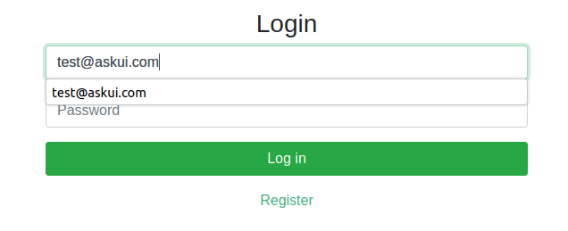

# Online Shop Test Tutorial

The following tutorial shows how to test the login process of a simple demo online shop.

## Setup

* Create a new npm project (create an empty folder and run `npm init -y`)
* Follow the [askui installation guide](../02-Getting%20Started/getting-started.md)
* Generate the askui example project files with `npx askui init`
* Open a browser on your screen
  * If you have multiple screens, configure the used display by setting the display variable at `helpers/askui-helper.ts`

## Test

After running the `npx askui init` command as described in the setup you will have a file `specs/my-first-askui-test-suite.spec.ts`. In this file add a new test inside the body of the callback passed to the `describe` function:

```ts
describe(/* a string identifying the test suite */, () => {
    ... (other tests)

    it('Should log into account', async () => {

    });
});
```

### 1. Open the Demo Shop

First we need to open the demo shop in the browser. For that we can type the url into the url bar and hit enter:

```ts
it('Should log into account', async () => {
    await aui.typeIn('https://askui-demo-shop-6e358.web.app/').url().exec();
    await aui.pressKey('enter').exec();
});
```

When you run this test with `npx jasmine --config=specs/support/jasmine.json`, you should see the demo online shop opening in the browser you opened.

### 2. Navigate to the Login Dialog

Next, to open the login dialog, we need to click the text login at the top of the page. We can do this with the following instruction:

```ts
it('Should log into account', async () => {
    ...
    await aui.click().text().withText('Login').exec();
});
```

### 3. Fill out Login Information

After opening the login dialog, we need to enter an email address and a password. For this we will use the `typeIn` command. After filling in an email address, depending on the browser used the textfield may open an auto-complete dropdown that overlaps with the password field:



To keep the password field visible, we have to hide the auto-complete dropdown. In order to do this, we have to blur the email input field. We do this by clicking on the headline of the page ("Login"). Afterwards, we can type into the password field.

```ts
it('Should log into account', async () => {
    ...
    await aui.typeIn('test@askui.com').textfield().contains().text().withText('Email Address').exec();
    await aui.click().text().withText('Login').above().textfield().exec();
    await aui.typeIn('passwort').textfield().contains().text().withText('Password').exec();
});
```

### 4. Click on Login Button

After filling in email and password, we need to click the login button. The following instruction does that for us:

```ts
it('Should log into account', async () => {
    ...
    await aui.click().button().contains().text().withText('Log in').exec();
});
```

### 5. Check whether Login worked & Log out

Finally, we need to check whether the login worked. We can do this by checking if the text "Logout test@askui.com" is displayed in the header as this is only displayed if we are logged in. We complete the test by logging out so that the test can easily be rerun without having to log out manually.

```ts
it('Should log into account', async () => {
    ...
    await aui.expect().text().withText('Logout test@askui.com').exists().exec();
    await aui.click().text().withText('Logout test@askui.com').exec();
});
```

## Result

The following code block shows the finished test for the login of the web shop:

```ts
it('Should log into account', async () => {
    await aui.typeIn('https://askui-demo-shop-6e358.web.app/').url().exec();
    await aui.pressKey('enter').exec();
    await aui.click().text().withText('Login').exec();
    await aui.typeIn('test@askui.com').textfield().contains().text().withText('Email Address').exec();
    await aui.click().text().withText('Login').above().textfield().exec();
    await aui.typeIn('passwort').textfield().contains().text().withText('Password').exec();
    await aui.click().button().contains().text().withText('Log in').exec();
    await aui.expect().text().withText('test@askui.com').exists().exec();
    await aui.click().text().withText('Logout test@askui.com').exec();
});
```

To run this test use the `npx jasmine --config=specs/support/jasmine.json` command.
